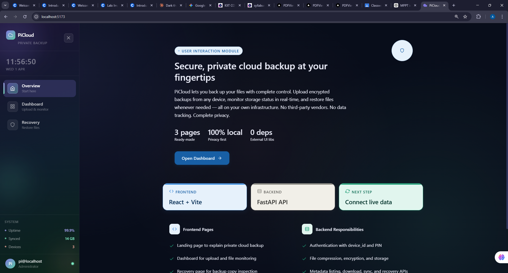
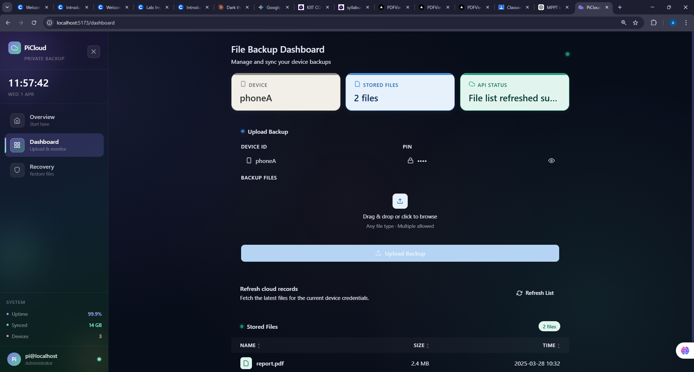
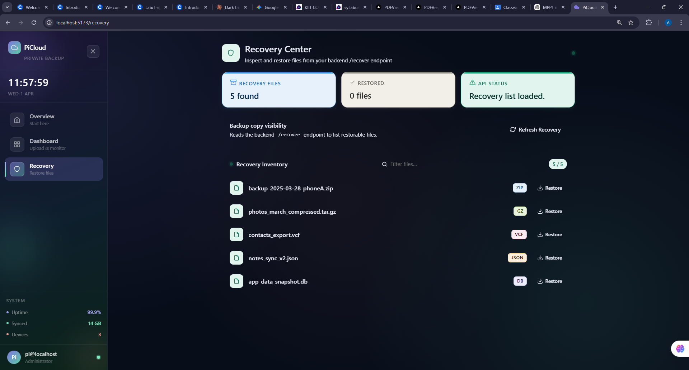

# BackupSystem-PiCloud

A lightweight private cloud backup system built with Python and FastAPI for securely storing mobile data on a personal server such as a Raspberry Pi. The project focuses on local ownership, encrypted file backup, simple recovery workflows, and basic performance evaluation without depending on third-party cloud providers.

## Overview

`BackupSystem-PiCloud` is designed as a private backup service where client devices upload files to a local server. Uploaded data is compressed, encrypted using a PIN-derived workflow, stored on disk, and indexed in SQLite for listing and recovery.

The system now includes a modern React-based web dashboard for easy file management, uploads, and recovery operations.

This project is useful as a student/demo system for:

- private cloud backup concepts
- Raspberry Pi or local-server deployment
- secure file transfer experiments
- backup and restore workflow demonstrations
- measuring local backup performance against cloud-style endpoints
- building full-stack web applications with FastAPI and React

## Website Overview

### Home Page (Overview)



This is the landing page of the PiCloud backup system. It provides an introduction to the private cloud backup concept, highlighting key features such as secure file storage, encryption, and recovery. The page displays system statistics including uptime, synced data, and connected devices. It also lists frontend features like the dashboard and recovery pages, and backend features like authentication and file processing.

### Dashboard Page



The dashboard is the main interface for file management. Users can upload files by entering their device ID and PIN, then selecting or dragging files to upload. The page shows a list of backed-up files with details like file name, size, and upload time. Status cards display current system metrics.

### Recovery Page



The recovery page allows users to view and download backup copies. It lists recovered files with their types (ZIP, GZ, VCF, JSON, DB) and provides download options. This page is essential for restoring data from backup archives.

## Features

- FastAPI-based backup server
- PIN-based device authentication
- file upload and backup endpoints
- encrypted storage workflow
- compressed file handling before storage
- SQLite metadata tracking
- file listing and download support
- recovery endpoint for backup copies
- sync endpoint for device data retrieval
- benchmark and performance test scripts
- React-based web dashboard for file management
- Modern UI with upload forms, file listings, and recovery pages

## Tech Stack

- Python
- FastAPI
- Uvicorn
- SQLite
- Cryptography
- Requests
- React
- Vite
- React Router

## Project Structure

```text
BackupSystem-PiCloud/
|-- server.py              # Main FastAPI application
|-- db.py                  # SQLite setup and metadata operations
|-- auth.py                # PIN validation helper
|-- encrypt.py             # Encryption-related utility script
|-- encryption_utils.py    # Core encryption helper functions
|-- decrypt_restore.py     # Restore/decryption helper script
|-- test_client.py         # Sample client upload simulator
|-- performance_test.py    # Throughput and response-time test
|-- benchmark.py           # Local vs external endpoint timing comparison
|-- stress_test.py         # Stress testing script
|-- plot_graphs.py         # Graph generation for benchmark output
|-- requirements.txt       # Python dependencies
|-- run.sh                 # Simple startup script
|-- graph_latency.png      # Generated latency graph
|-- graph_throughput.png   # Generated throughput graph
|-- assets/                # Screenshots for README
|-- frontend/              # React-based web dashboard
|   |-- index.html
|   |-- package.json
|   |-- vite.config.js
|   |-- src/
|       |-- App.jsx
|       |-- main.jsx
|       |-- components/
|       |   |-- FileList.jsx
|       |   |-- StatusCard.jsx
|       |   |-- UploadForm.jsx
|       |-- pages/
|       |   |-- DashboardPage.jsx
|       |   |-- HomePage.jsx
|       |   |-- RecoveryPage.jsx
|       |-- services/
|       |   |-- api.js
|       |-- styles/
|           |-- index.css
|-- cloud_data/            # Encrypted file storage directory
|-- backup_copy/           # Backup copies for fault tolerance
```

## How It Works

1. A client sends files to the FastAPI server using multipart form data.
2. The server authenticates the device using `device_id` and `pin`.
3. Each file is compressed before storage.
4. The compressed data is encrypted.
5. The encrypted file is stored in the local cloud directory.
6. A secondary backup copy is written for fault tolerance.
7. File metadata is saved in SQLite for later listing and recovery.

## API Endpoints

### `GET /`

Health-style root message for quick confirmation that the service is running.

### `GET /health`

Returns server status and current timestamp.

### `POST /backup`

Uploads one or more files using:

- `pin`
- `device_id`
- `files`

Returns upload status, saved file names, hashes, and upload time.

### `GET /list`

Lists backed-up files for a device using:

- `pin`
- `device_id`

### `GET /download`

Downloads a stored file using:

- `file_path`
- `pin`
- `device_id`

### `DELETE /delete`

Deletes a file by path.

### `GET /recover`

Returns the list of files available in the backup copy directory.

### `GET /sync`

Returns stored metadata for a device to support sync-style workflows.

## Installation

### 1. Clone the repository

```bash
git clone https://github.com/Aniketsahoo228/BackupSystem-PiCloud.git
cd BackupSystem-PiCloud
```

### 2. Backend Setup

Create a virtual environment:

Windows PowerShell:

```powershell
python -m venv venv
.\venv\Scripts\Activate.ps1
```

Linux/macOS:

```bash
python3 -m venv venv
source venv/bin/activate
```

Install Python dependencies:

```bash
pip install -r requirements.txt
```

### 3. Frontend Setup

```bash
cd frontend
npm install
cd ..
```

## Run The Application

### Backend Server

Using Uvicorn directly:

```bash
uvicorn server:app --host 0.0.0.0 --port 8000
```

Or with the helper script on Linux/macOS:

```bash
bash run.sh
```

### Frontend Dashboard

```bash
cd frontend
npm run dev
```

The application will be available at:

- Backend API: `http://127.0.0.1:8000`
- Frontend Web App: `http://127.0.0.1:5173`
- Interactive API docs: `http://127.0.0.1:8000/docs`

## Example Request

```bash
curl -X POST "http://127.0.0.1:8000/backup" \
  -F "pin=1234" \
  -F "device_id=phoneA" \
  -F "files=@testfile.enc"
```

## Test And Benchmark Scripts

- `test_client.py` simulates a client device and uploads encrypted sample data
- `performance_test.py` measures response time and throughput
- `benchmark.py` compares local-server timing against an external endpoint
- `plot_graphs.py` generates graphs for latency and throughput analysis

Before running the client or benchmark scripts, update the hardcoded server IP address if needed.

## Current Notes

- Device authentication is currently based on static credentials defined in `server.py`.
- Some scripts are demo-oriented and may need cleanup before production use.

## Future Improvements

- replace hardcoded device credentials with proper user management
- improve file path safety and delete authorization
- add automated tests
- support scheduled backups
- add Docker deployment
- improve recovery and restore workflows

## Author

Aniket Sahoo

## License

This project is currently shared without an explicit license file. Add a license before public reuse or redistribution.
